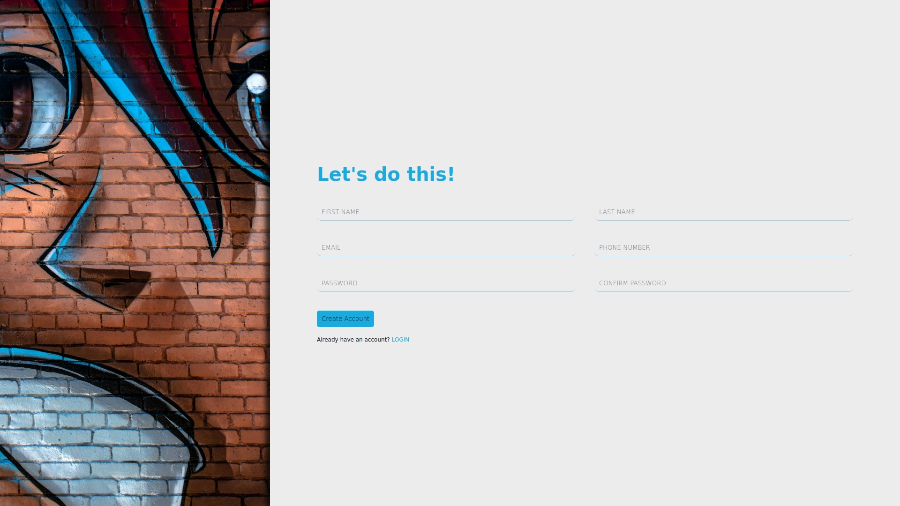

# SignUp-form

This project is a frontend SignUp form built as part of [The Odin Project](https://www.theodinproject.com/) curriculum. It focuses on practicing HTML, CSS, speciffically flexbox and grid layouts.

## Tech Stack

||
||

## ScreenShot

## Preview

[Live Demo](https://anthonybac.github.io/SIgnUpForm-Front-_TheOdinProject/)
